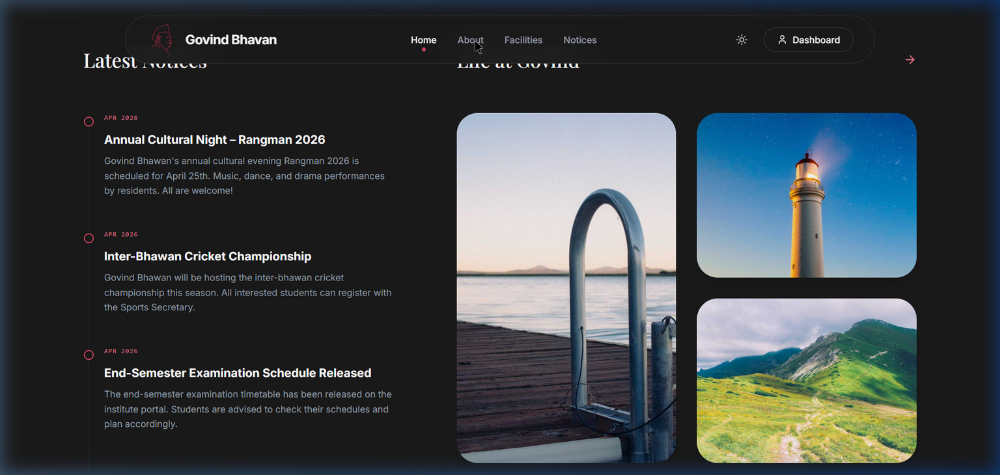

# Govind Bhavan Portal

> A comprehensive, modern, and highly-scalable Student & Administration Portal for Govind Bhavan.



## Overview

The Govind Bhavan Portal is an end-to-end management solution designed to streamline the operations and enhance the residential experience of students at Govind Bhavan. It features separate, highly secure dashboards for Students and Administrators, with strict role-based access controls and optimized data retrieval.

## Features

### 👨‍🎓 Student Portal
- **Dashboard Overview:** Real-time visibility into active complaints, upcoming events, and personal room details.
- **Complaint Management:** Identity-locked complaint submission with granular tracking (Open/In Progress/Resolved).
- **Mess & Dining:** Interactive weekly mess menu with a student-driven daily rating system (upvotes/downvotes).
- **Facilities & Rebates:** Direct requests for Mess Rebates enforcement of a 3-day minimum duration protocol.
- **Guest Bookings:** Chronologically validated guest room bookings.
- **Event Registration:** Seamless one-click registration with real-time capacity and expired-event lockouts.

### 🔐 Admin Portal
- **Centralized Command Center:** At-a-glance KPI metrics across all student interactions.
- **Noticeboard Management:** Full CRUD operations for global notices, announcements, and pinned alerts.
- **Data Export:** Cross-browser compatible one-click CSV exports for students, complaints, rebates, and guest lists.
- **Approvals & Overrides:** Instant confirm/reject actions for mess rebates and guest accommodations.
- **Event Administration:** Track participant lists, view enrollment branches/rooms, and manage waitlists.
- **Master Mess Menu Editor:** A unified interface to set the entire week's menu and review student sentiment statistics.

## Tech Stack

The application is built leveraging a modern, high-performance stack:

- **Frontend:** React 19, TypeScript, Vite, Tailwind CSS v4
- **State & Context:** React Context API (Modularized by feature domain)
- **Animation & UI:** Framer Motion (`motion/react`), Lucide Icons
- **Backend Infrastructure:** Express.js, TypeScript, TSX
- **Database:** MongoDB via Mongoose Models
- **Form Validation:** React Hook Form + Zod

## Getting Started

### Prerequisites
- Node.js (v18+)
- MongoDB (Running locally or a set `MONGODB_URI`)

### Installation

1. Install dependencies:
   ```bash
   npm install
   ```

2. Configure environment variables in `.env.local`:
   ```env
   MONGODB_URI=mongodb://localhost:27017/govind_bhawan
   JWT_SECRET=your_super_secret_key_here
   ```

3. Seed the database (Initial setup):
   ```bash
   npm run seed
   ```

4. Run the development stack (Client + Server concurrently):
   ```bash
   npm run dev:full
   ```

### Production Build

To build the project for production, run:
```bash
npm run build
```

## Data Consistency & Security
- **Role-Based Scoping:** API routes and context providers automatically scope data logic based on the authenticated user's role and MongoDB `_id`.
- **Bulletproof Exports:** Custom CSV export utility utilizing `file-saver` and Data URIs to bypass browser restrictions and gracefully serialize complex objects, arrays, and Unicode characters.
- **Type Safety:** 100% strict TypeScript enforcement (`tsc --noEmit` verified).

---
*Developed with ❤️ for the residents of Govind Bhavan.*
